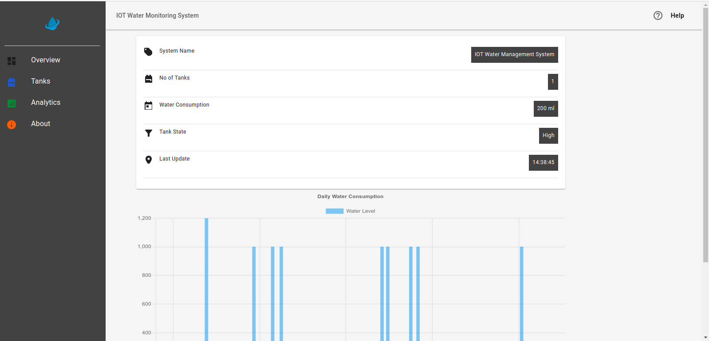
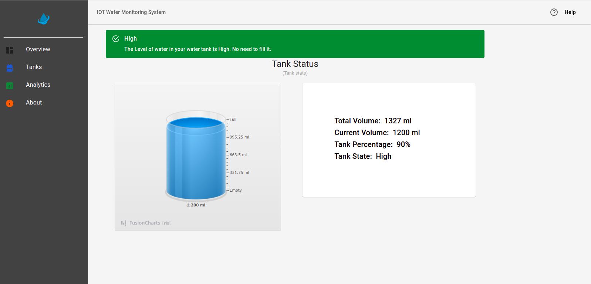
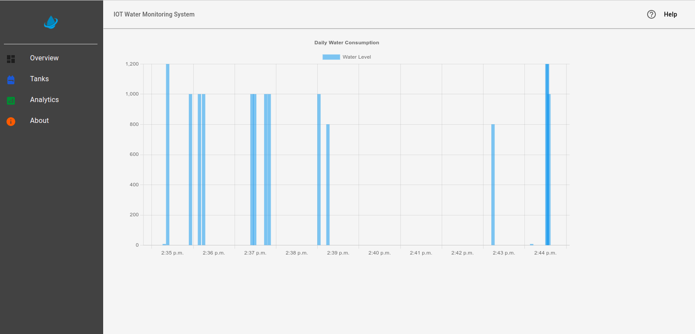
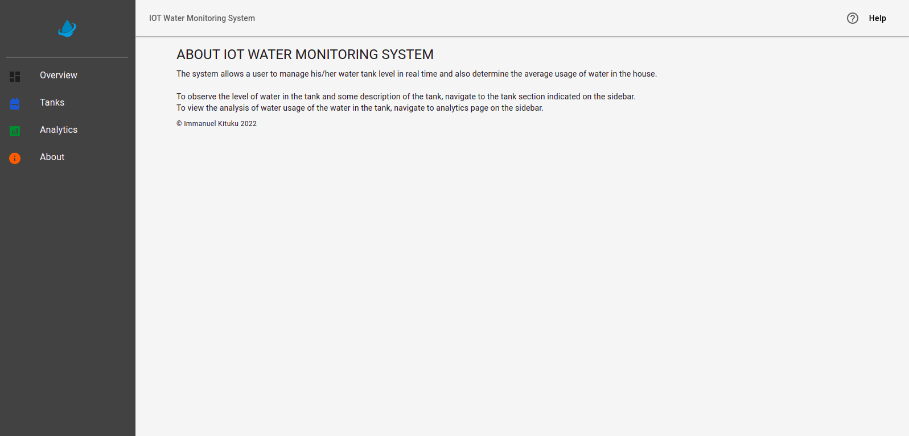

# IoT Water Management System

## Abstract

Water is a basic need of human beings and it faces the danger of being scarce due to its wastage and
environmental factors. There is a need for using it sparingly. This project addresses the issue by
providing a solution to residential societies. It involves the use of IoT to realize water management
in residential households. IoT has aided in the automation of many tasks in the world. This project
involves the use of a micro-controller, that is, the ESP 32 that sends sensor data to Firebase through
wireless means and an Arduino board that powers an ultrasonic sensor that is used to measure the
level of water in a tank or reservoir. The data collected from the sensor and sent to the server is then
processed and presented to the user in form of a tank simulation which shows the level of water in
real-time and in case water is used, a graph dynamically displays the current level of water present
in the tank to the user. Other details are also presented to the user to equip him/her with the
necessary information to create awareness of usage and tank status. The platform used to display all
this information is a web application accompanied by a mobile application for convenience. This
project helps create awareness among users on their water consumption and enables them to plan
properly and prevent the wastage of water.

## Programming Languages / Tools

- HTML
- CSS
- Javascript
- ReactJs
- Material UI
- React Router
- Chart.js
- Firebase
- Progressive Web Apps (PWA)

## Preview of Projects

Below are screen shots of the project:

1. ### Dashboard

2. ### Tank Page

3. ### Analytic Page

4. ### About Page

## Conclusion

This is a work in progress and I hope to make it a fully fledged water management system.

Coded with ❤️ by **Immanuel Kituku**
